# Carta API Schema Documentation

This directory contains documentation for the JSON schemas used in the Carta API. The documentation is auto-generated from the OpenAPI specification.

## 🎨 Interactive Schema Dependency Graph

**[Open Interactive Graph →](schema-graph.html)** - Explore the full schema dependency graph with:
- 🔍 **Search** - Find any schema instantly
- 🖱️ **Drag & Drop** - Reposition nodes
- 🔎 **Zoom & Pan** - Navigate the graph
- 📊 **Live Stats** - See reference counts
- 💡 **Hover Tooltips** - View schema details
- 🎯 **Click to Navigate** - Jump to documentation

The interactive graph uses a force-directed layout algorithm to automatically position schemas based on their relationships, making it easy to understand the API structure at a glance.

---

## Schema Dependency Diagram

This diagram shows how API objects (blue rectangles) reference supporting types (purple rounded boxes):

```mermaid
graph TD
    stakeholder_entity_type("Stakeholder Entity Type")
    class stakeholder_entity_type typeNode
    click stakeholder_entity_type "types/stakeholder_entity_type/"
    issuerssecurities_exercise_periods("Issuerssecurities Exercise ...")
    class issuerssecurities_exercise_periods typeNode
    click issuerssecurities_exercise_periods "types/issuerssecurities_exercise_periods/"
    draft_securities_service_create_draft_option_grant_body["Draft Securities Service Cr..."]
    class draft_securities_service_create_draft_option_grant_body objectNode
    click draft_securities_service_create_draft_option_grant_body "objects/draft_securities_service_create_draft_option_grant_body/"
    day_count_basis("Day Count Basis")
    class day_count_basis typeNode
    click day_count_basis "types/day_count_basis/"
    stakeholder_address("Stakeholder Address")
    class stakeholder_address typeNode
    click stakeholder_address "types/stakeholder_address/"
    exercise_service_update_money_movement_body["Exercise Service Update Mon..."]
    class exercise_service_update_money_movement_body objectNode
    click exercise_service_update_money_movement_body "objects/exercise_service_update_money_movement_body/"
    share_class["Share Class"]
    class share_class objectNode
    click share_class "objects/share_class/"
    option_exercise_tax_withholding_line_item("Option Exercise Tax Withhol...")
    class option_exercise_tax_withholding_line_item typeNode
    click option_exercise_tax_withholding_line_item "types/option_exercise_tax_withholding_line_item/"
    restricted_stock_unit_settlement("Restricted Stock Unit Settl...")
    class restricted_stock_unit_settlement typeNode
    click restricted_stock_unit_settlement "types/restricted_stock_unit_settlement/"
    iso8601_complete_calendar_date("Iso8601 Complete Calendar Date")
    class iso8601_complete_calendar_date typeNode,highlyUsed
    click iso8601_complete_calendar_date "types/iso8601_complete_calendar_date/"
    exercise_service_update_tax_withholding_body["Exercise Service Update Tax..."]
    class exercise_service_update_tax_withholding_body objectNode
    click exercise_service_update_tax_withholding_body "objects/exercise_service_update_tax_withholding_body/"
    point_of_contact["Point Of Contact"]
    class point_of_contact objectNode
    click point_of_contact "objects/point_of_contact/"
    restricted_stock_unit["Restricted Stock Unit"]
    class restricted_stock_unit objectNode
    click restricted_stock_unit "objects/restricted_stock_unit/"
    publicapiissuers_stakeholder_relationship("Publicapiissuers Stakeholde...")
    class publicapiissuers_stakeholder_relationship typeNode
    click publicapiissuers_stakeholder_relationship "types/publicapiissuers_stakeholder_relationship/"
    vesting_schedule_type("Vesting Schedule Type")
    class vesting_schedule_type typeNode
    click vesting_schedule_type "types/vesting_schedule_type/"
    restricted_stock_unit_vesting_event("Restricted Stock Unit Vesti...")
    class restricted_stock_unit_vesting_event typeNode
    click restricted_stock_unit_vesting_event "types/restricted_stock_unit_vesting_event/"
    option_exercise_state("Option Exercise State")
    class option_exercise_state typeNode
    click option_exercise_state "types/option_exercise_state/"
    publicapiissuers_stakeholder["Publicapiissuers Stakeholder"]
    class publicapiissuers_stakeholder objectNode
    click publicapiissuers_stakeholder "objects/publicapiissuers_stakeholder/"
    note_block("Note Block")
    class note_block typeNode
    click note_block "types/note_block/"
    benchmark_job["Benchmark Job"]
    class benchmark_job objectNode
    click benchmark_job "objects/benchmark_job/"
    threshold_details("Threshold Details")
    class threshold_details typeNode
    click threshold_details "types/threshold_details/"
    issuersinterests_vesting_schedule("Issuersinterests Vesting Sc...")
    class issuersinterests_vesting_schedule typeNode
    click issuersinterests_vesting_schedule "types/issuersinterests_vesting_schedule/"
    certificate["Certificate"]
    class certificate objectNode
    click certificate "objects/certificate/"
    decimal("Decimal")
    class decimal typeNode,highlyUsed
    click decimal "types/decimal/"
    issuerssecurities_stock_option_type("Issuerssecurities Stock Opt...")
    class issuerssecurities_stock_option_type typeNode
    click issuerssecurities_stock_option_type "types/issuerssecurities_stock_option_type/"
    iso8601_complete_calendar_date_time("Iso8601 Complete Calendar D...")
    class iso8601_complete_calendar_date_time typeNode,highlyUsed
    click iso8601_complete_calendar_date_time "types/iso8601_complete_calendar_date_time/"
    exercise("Exercise")
    class exercise typeNode
    click exercise "types/exercise/"
    preferred_share_class_details("Preferred Share Class Details")
    class preferred_share_class_details typeNode
    click preferred_share_class_details "types/preferred_share_class_details/"
    option_exercise_type("Option Exercise Type")
    class option_exercise_type typeNode
    click option_exercise_type "types/option_exercise_type/"
    option_grant_vesting_event("Option Grant Vesting Event")
    class option_grant_vesting_event typeNode
    click option_grant_vesting_event "types/option_grant_vesting_event/"
    option_exercise_money_movement("Option Exercise Money Movement")
    class option_exercise_money_movement typeNode
    click option_exercise_money_movement "types/option_exercise_money_movement/"
    interest_compounding_period("Interest Compounding Period")
    class interest_compounding_period typeNode
    click interest_compounding_period "types/interest_compounding_period/"
    money("Money")
    class money typeNode,highlyUsed
    click money "types/money/"
    point_of_contact_type("Point Of Contact Type")
    class point_of_contact_type typeNode
    click point_of_contact_type "types/point_of_contact_type/"
    option_exercise["Option Exercise"]
    class option_exercise objectNode
    click option_exercise "objects/option_exercise/"
    share_class_valuation("Share Class Valuation")
    class share_class_valuation typeNode
    click share_class_valuation "types/share_class_valuation/"
    fair_market_value["Fair Market Value"]
    class fair_market_value objectNode
    click fair_market_value "objects/fair_market_value/"
    benchmarks["Benchmarks"]
    class benchmarks objectNode
    click benchmarks "objects/benchmarks/"
    issuer["Issuer"]
    class issuer objectNode
    click issuer "objects/issuer/"
    interest_accrual_period("Interest Accrual Period")
    class interest_accrual_period typeNode
    click interest_accrual_period "types/interest_accrual_period/"
    option_grant["Option Grant"]
    class option_grant objectNode
    click option_grant "objects/option_grant/"
    convertible_note["Convertible Note"]
    class convertible_note objectNode
    click convertible_note "objects/convertible_note/"
    securitiesoptionexercises_stock_option_type("Securitiesoptionexercises S...")
    class securitiesoptionexercises_stock_option_type typeNode
    click securitiesoptionexercises_stock_option_type "types/securitiesoptionexercises_stock_option_type/"
    issuerssecurities_vesting_schedule("Issuerssecurities Vesting S...")
    class issuerssecurities_vesting_schedule typeNode
    click issuerssecurities_vesting_schedule "types/issuerssecurities_vesting_schedule/"
    corporation["Corporation"]
    class corporation objectNode
    click corporation "objects/corporation/"
    draft_option_grant("Draft Option Grant")
    class draft_option_grant typeNode
    click draft_option_grant "types/draft_option_grant/"
    restricted_stock_award["Restricted Stock Award"]
    class restricted_stock_award objectNode
    click restricted_stock_award "objects/restricted_stock_award/"
    share_class_type("Share Class Type")
    class share_class_type typeNode
    click share_class_type "types/share_class_type/"
    benchmark_value("Benchmark Value")
    class benchmark_value typeNode
    click benchmark_value "types/benchmark_value/"
    restricted_stock_award_vesting_event("Restricted Stock Award Vest...")
    class restricted_stock_award_vesting_event typeNode
    click restricted_stock_award_vesting_event "types/restricted_stock_award_vesting_event/"
    interest["Interest"]
    class interest objectNode
    click interest "objects/interest/"
    vesting_schedule_template["Vesting Schedule Template"]
    class vesting_schedule_template objectNode
    click vesting_schedule_template "objects/vesting_schedule_template/"
    draft_securities_service_create_draft_option_grant_body --> draft_option_grant
    exercise_service_update_money_movement_body --> option_exercise_money_movement
    exercise_service_update_tax_withholding_body --> option_exercise_tax_withholding_line_item
    publicapiissuers_stakeholder --> publicapiissuers_stakeholder_relationship
    publicapiissuers_stakeholder --> stakeholder_entity_type
    publicapiissuers_stakeholder --> stakeholder_address
    benchmarks --> benchmark_value
    certificate --> iso8601_complete_calendar_date
    certificate --> decimal
    certificate --> money
    certificate --> iso8601_complete_calendar_date_time
    convertible_note --> iso8601_complete_calendar_date_time
    convertible_note --> money
    convertible_note --> note_block
    convertible_note --> interest_accrual_period
    convertible_note --> decimal
    convertible_note --> interest_compounding_period
    convertible_note --> day_count_basis
    fair_market_value --> iso8601_complete_calendar_date
    fair_market_value --> share_class_valuation
    interest --> iso8601_complete_calendar_date
    interest --> iso8601_complete_calendar_date_time
    interest --> threshold_details
    interest --> money
    interest --> decimal
    interest --> issuersinterests_vesting_schedule
    option_exercise --> decimal
    option_exercise --> iso8601_complete_calendar_date_time
    option_exercise --> option_exercise_state
    option_exercise --> option_exercise_type
    option_exercise --> securitiesoptionexercises_stock_option_type
    option_exercise --> option_exercise_tax_withholding_line_item
    option_exercise --> option_exercise_money_movement
    option_grant --> iso8601_complete_calendar_date
    option_grant --> issuerssecurities_stock_option_type
    option_grant --> decimal
    option_grant --> money
    option_grant --> option_grant_vesting_event
    option_grant --> exercise
    option_grant --> issuerssecurities_vesting_schedule
    option_grant --> iso8601_complete_calendar_date_time
    option_grant --> issuerssecurities_exercise_periods
    point_of_contact --> point_of_contact_type
    restricted_stock_award --> iso8601_complete_calendar_date
    restricted_stock_award --> decimal
    restricted_stock_award --> money
    restricted_stock_award --> restricted_stock_award_vesting_event
    restricted_stock_award --> issuerssecurities_vesting_schedule
    restricted_stock_award --> iso8601_complete_calendar_date_time
    restricted_stock_unit --> iso8601_complete_calendar_date
    restricted_stock_unit --> decimal
    restricted_stock_unit --> money
    restricted_stock_unit --> restricted_stock_unit_vesting_event
    restricted_stock_unit --> restricted_stock_unit_settlement
    restricted_stock_unit --> issuerssecurities_vesting_schedule
    restricted_stock_unit --> iso8601_complete_calendar_date_time
    share_class --> share_class_type
    share_class --> decimal
    share_class --> money
    share_class --> preferred_share_class_details
    vesting_schedule_template --> vesting_schedule_type

    classDef objectNode fill:#e1f5ff,stroke:#01579b,stroke-width:3px,font-size:16px,font-weight:bold
    classDef typeNode fill:#f3e5f5,stroke:#4a148c,stroke-width:1px
    classDef highlyUsed fill:#fff9c4,stroke:#f57f17,stroke-width:3px,stroke-dasharray:5 5
```

**Legend:**
- 🔵 **Blue rectangles (larger, bold)** = Primary API objects (with endpoints)
- 🟣 **Purple rounded boxes** = Supporting types
- ⭐ **Yellow highlighted with dashed border** = Highly-used schemas (10+ references)
- ➡️ **Arrows** = "uses" or "references" relationship

---

### Most Referenced Schemas

These schemas are used by many other schemas:

- [Decimal](types/decimal.md) - referenced by 28 schemas
- [Money](types/money.md) - referenced by 20 schemas
- [Iso8601 Complete Calendar Date](types/iso8601_complete_calendar_date.md) - referenced by 16 schemas
- [Iso8601 Complete Calendar Date Time](types/iso8601_complete_calendar_date_time.md) - referenced by 11 schemas
- [Issuerssecurities Vesting Schedule](types/issuerssecurities_vesting_schedule.md) - referenced by 3 schemas
- [Draft Option Grant](types/draft_option_grant.md) - referenced by 3 schemas
- [Option Exercise Money Movement](types/option_exercise_money_movement.md) - referenced by 3 schemas
- [Option Exercise Tax Withholding Line Item](types/option_exercise_tax_withholding_line_item.md) - referenced by 3 schemas
- [Publicapiissuers Stakeholder](objects/publicapiissuers_stakeholder.md) - referenced by 2 schemas
- [Benchmarks Metadata](types/benchmarks_metadata.md) - referenced by 2 schemas

### Most Complex Schemas

These schemas reference many other schemas:

- [Draft Option Grant](types/draft_option_grant.md) - references 13 other schemas
- [Option Grant](objects/option_grant.md) - references 9 other schemas
- [Convertible Note](objects/convertible_note.md) - references 7 other schemas
- [Option Exercise](objects/option_exercise.md) - references 7 other schemas
- [Restricted Stock Unit](objects/restricted_stock_unit.md) - references 7 other schemas
- [Capitalization Table](types/capitalization_table.md) - references 6 other schemas
- [Interest](objects/interest.md) - references 6 other schemas
- [Restricted Stock Award](objects/restricted_stock_award.md) - references 6 other schemas
- [Stakeholder Group](types/stakeholder_group.md) - references 6 other schemas
- [Issuerscapitalization Stakeholder](types/issuerscapitalization_stakeholder.md) - references 5 other schemas

---

## Schema Index

#### Objects

- [Benchmark Job](objects/benchmark_job.md)
- [Benchmarks](objects/benchmarks.md)
- [Certificate](objects/certificate.md)
- [Convertible Note](objects/convertible_note.md)
- [Corporation](objects/corporation.md)
- [Draft Securities Service Create Draft Option Grant Body](objects/draft_securities_service_create_draft_option_grant_body.md)
- [Exercise Service Update Money Movement Body](objects/exercise_service_update_money_movement_body.md)
- [Exercise Service Update Tax Withholding Body](objects/exercise_service_update_tax_withholding_body.md)
- [Fair Market Value](objects/fair_market_value.md)
- [Interest](objects/interest.md)
- [Issuer](objects/issuer.md)
- [Option Exercise](objects/option_exercise.md)
- [Option Grant](objects/option_grant.md)
- [Point Of Contact](objects/point_of_contact.md)
- [Publicapiissuers Stakeholder](objects/publicapiissuers_stakeholder.md)
- [Restricted Stock Award](objects/restricted_stock_award.md)
- [Restricted Stock Unit](objects/restricted_stock_unit.md)
- [Share Class](objects/share_class.md)
- [Vesting Schedule Template](objects/vesting_schedule_template.md)

#### Types

- [Acceleration](types/acceleration.md)
- [Access](types/access.md)
- [Benchmark Value](types/benchmark_value.md)
- [Benchmarks Metadata](types/benchmarks_metadata.md)
- [Board Approval](types/board_approval.md)
- [Capitalization Table](types/capitalization_table.md)
- [Capitalization Table Summary](types/capitalization_table_summary.md)
- [Compliance](types/compliance.md)
- [Create Draft Option Grant Response](types/create_draft_option_grant_response.md)
- [Date](types/date.md)
- [Day Count Basis](types/day_count_basis.md)
- [Decimal](types/decimal.md)
- [Dividend Accrual Period](types/dividend_accrual_period.md)
- [Dividend Accrual Type](types/dividend_accrual_type.md)
- [Dividend Details](types/dividend_details.md)
- [Dividend Interest Type](types/dividend_interest_type.md)
- [Dividend Type](types/dividend_type.md)
- [Document](types/document.md)
- [Draft Option Grant](types/draft_option_grant.md)
- [Draft Security State](types/draft_security_state.md)
- [Exercise](types/exercise.md)
- [Exercise Status](types/exercise_status.md)
- [Exercise Type](types/exercise_type.md)
- [Federal Exemption](types/federal_exemption.md)
- [Get Capitalization Table Response](types/get_capitalization_table_response.md)
- [Get Certificate Response](types/get_certificate_response.md)
- [Get Compensation Benchmark Attributes Response](types/get_compensation_benchmark_attributes_response.md)
- [Get Compensation Benchmarks Response](types/get_compensation_benchmarks_response.md)
- [Get Convertible Note Response](types/get_convertible_note_response.md)
- [Get Draft Option Grant Response](types/get_draft_option_grant_response.md)
- [Get Issuer Response](types/get_issuer_response.md)
- [Get Option Grant Response](types/get_option_grant_response.md)
- [Get Restricted Stock Award Response](types/get_restricted_stock_award_response.md)
- [Get Restricted Stock Unit Response](types/get_restricted_stock_unit_response.md)
- [Get Stakeholder Capitalization Table Response](types/get_stakeholder_capitalization_table_response.md)
- [Get Stakeholder Response](types/get_stakeholder_response.md)
- [Grant Reason](types/grant_reason.md)
- [Interest Accrual Period](types/interest_accrual_period.md)
- [Interest Compounding Period](types/interest_compounding_period.md)
- [Iso3166 Set1 Alpha3 Code](types/iso3166_set1_alpha3_code.md)
- [Iso3166 Set2 Code](types/iso3166_set2_code.md)
- [Iso4217 Currency Alpha Code](types/iso4217_currency_alpha_code.md)
- [Iso8601 Complete Calendar Date](types/iso8601_complete_calendar_date.md)
- [Iso8601 Complete Calendar Date Time](types/iso8601_complete_calendar_date_time.md)
- [Issuerscapitalization Stakeholder](types/issuerscapitalization_stakeholder.md)
- [Issuersdraftsecurities Exercise Period](types/issuersdraftsecurities_exercise_period.md)
- [Issuersdraftsecurities Exercise Periods](types/issuersdraftsecurities_exercise_periods.md)
- [Issuersdraftsecurities Stakeholder](types/issuersdraftsecurities_stakeholder.md)
- [Issuersdraftsecurities Stakeholder Relationship](types/issuersdraftsecurities_stakeholder_relationship.md)
- [Issuersdraftsecurities Stock Option Type](types/issuersdraftsecurities_stock_option_type.md)
- [Issuersinterests Vesting Schedule](types/issuersinterests_vesting_schedule.md)
- [Issuerssecurities Exercise Period](types/issuerssecurities_exercise_period.md)
- [Issuerssecurities Exercise Periods](types/issuerssecurities_exercise_periods.md)
- [Issuerssecurities Stock Option Type](types/issuerssecurities_stock_option_type.md)
- [Issuerssecurities Vesting Schedule](types/issuerssecurities_vesting_schedule.md)
- [Jurisdiction](types/jurisdiction.md)
- [List Certificates Response](types/list_certificates_response.md)
- [List Convertible Notes Response](types/list_convertible_notes_response.md)
- [List Corporations Response](types/list_corporations_response.md)
- [List Fair Market Values Response](types/list_fair_market_values_response.md)
- [List Interests Response](types/list_interests_response.md)
- [List Issuers Response](types/list_issuers_response.md)
- [List Option Exercises Response](types/list_option_exercises_response.md)
- [List Option Grants Response](types/list_option_grants_response.md)
- [List Points Of Contact Response](types/list_points_of_contact_response.md)
- [List Restricted Stock Awards Response](types/list_restricted_stock_awards_response.md)
- [List Restricted Stock Units Response](types/list_restricted_stock_units_response.md)
- [List Share Classes Response](types/list_share_classes_response.md)
- [List Stakeholders Response](types/list_stakeholders_response.md)
- [List Vesting Schedule Templates Response](types/list_vesting_schedule_templates_response.md)
- [Money](types/money.md)
- [Note Block](types/note_block.md)
- [Note Block Status](types/note_block_status.md)
- [Note Block Summary](types/note_block_summary.md)
- [Note Type](types/note_type.md)
- [Option Exercise Money Movement](types/option_exercise_money_movement.md)
- [Option Exercise State](types/option_exercise_state.md)
- [Option Exercise Tax Withholding Line Item](types/option_exercise_tax_withholding_line_item.md)
- [Option Exercise Type](types/option_exercise_type.md)
- [Option Grant Documents](types/option_grant_documents.md)
- [Option Grant Vesting Event](types/option_grant_vesting_event.md)
- [Option Pool Summary](types/option_pool_summary.md)
- [Point Of Contact Type](types/point_of_contact_type.md)
- [Preferred Share Class Details](types/preferred_share_class_details.md)
- [Protobuf Any](types/protobuf_any.md)
- [Publicapiissuers Stakeholder Relationship](types/publicapiissuers_stakeholder_relationship.md)
- [Restricted Stock Award Vesting Event](types/restricted_stock_award_vesting_event.md)
- [Restricted Stock Unit Settlement](types/restricted_stock_unit_settlement.md)
- [Restricted Stock Unit Vesting Event](types/restricted_stock_unit_vesting_event.md)
- [Rpc Status](types/rpc_status.md)
- [Securitiesoptionexercises Stock Option Type](types/securitiesoptionexercises_stock_option_type.md)
- [Share Class Dividend Details](types/share_class_dividend_details.md)
- [Share Class Rights And Preferences](types/share_class_rights_and_preferences.md)
- [Share Class Summary](types/share_class_summary.md)
- [Share Class Type](types/share_class_type.md)
- [Share Class Valuation](types/share_class_valuation.md)
- [Stakeholder Address](types/stakeholder_address.md)
- [Stakeholder Capitalization Table](types/stakeholder_capitalization_table.md)
- [Stakeholder Capitalization Table Summary](types/stakeholder_capitalization_table_summary.md)
- [Stakeholder Entity Type](types/stakeholder_entity_type.md)
- [Stakeholder Group](types/stakeholder_group.md)
- [Stakeholder Note Block Summary](types/stakeholder_note_block_summary.md)
- [Stakeholder Option Pool Summary](types/stakeholder_option_pool_summary.md)
- [Stakeholder Share Class Summary](types/stakeholder_share_class_summary.md)
- [Stakeholder Type](types/stakeholder_type.md)
- [Stakeholder Warrant Block Summary](types/stakeholder_warrant_block_summary.md)
- [Threshold Details](types/threshold_details.md)
- [Threshold Details Threshold Type](types/threshold_details_threshold_type.md)
- [Update Money Movement Response](types/update_money_movement_response.md)
- [Update Tax Withholding Response](types/update_tax_withholding_response.md)
- [Vesting](types/vesting.md)
- [Vesting Schedule Type](types/vesting_schedule_type.md)
- [Warrant Block Summary](types/warrant_block_summary.md)

---
_This documentation is auto-generated._
